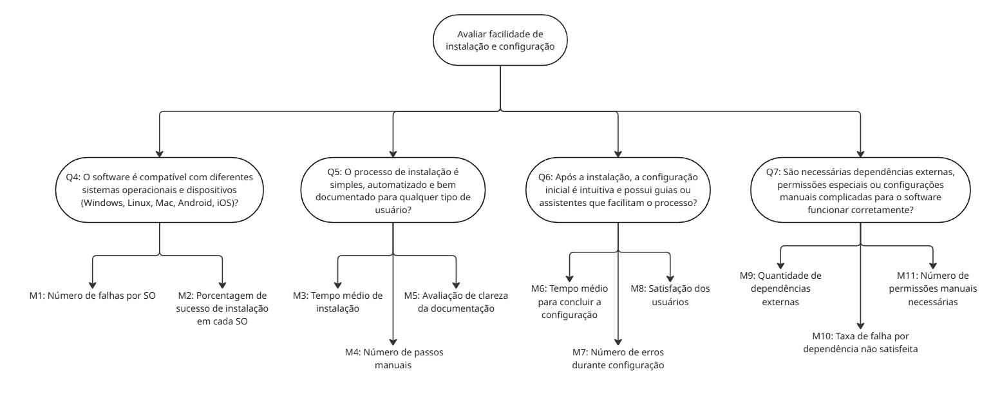

## Objetivo de negócio do AGROMART

O Agromart é uma plataforma digital que conecta agricultores familiares a consumidores, facilitando a divulgação e venda de produtos agroecológicos. Criado durante um Hackathon da UnB-FGA em 2020, o projeto evoluiu para atender às necessidades das CSAs, incorporando funcionalidades como geolocalização, filtros, contato direto e pagamento digital. Hoje, segue em desenvolvimento como software open source, promovendo a produção sustentável e o consumo consciente.

A seguir, apresenta-se a primeira etapa do modelo GQM, que consiste na definição do objetivo de negócio do projeto:

Aprimorar a conexão entre agricultores familiares e consumidores, promovendo a divulgação eficiente de produtos agroecológicos por meio de uma plataforma digital acessível, especialmente adaptada ao contexto de CSAs (Comunidades que Sustentam a Agricultura), com funcionalidades que atendem às necessidades de comunicação, localização e transações, inicialmente motivada pela necessidade de superação do isolamento social decorrente da pandemia de COVID-19.

## Adaptação para Portabilidade

Segue a reformulação do documento com foco em portabilidade, mantendo a estrutura original mas adaptando os objetivos, perguntas e critérios de qualidade:

## Objetivo do Negócio

Garantir que a plataforma possa ser facilmente adaptada e executada em diferentes ambientes (dispositivos, sistemas operacionais, navegadores e contextos tecnológicos), com especial atenção à inclusão de usuários com baixa alfabetização digital, mantendo a simplicidade e acessibilidade em todos os ambientes suportados.

A tabela 1 apresenta o objetivo de medição do nosso projeto:

**Tabela 1 -** Objetivo de medição.
 
	

| Componente        | Descrição                                 |
|-------------------|------------------------------------------|
| Analisa           | Capacidade de adaptação do sistema       |
| Propósito         | Avaliar a portabilidade da solução       |
| Critérios         | Adaptabilidade e compatibilidade         |
| Perspectiva       | Equipe técnica e usuários finais         |
| Contexto          | Disciplina de Qualidade de Software      |

Fonte: [João Lobo](https://github.com/joaolobo10), [João Sapiência](JoaoSapiencia), [Rodrigo Gontijo](rodrigogontijoo), 2025.

## Objetivo 1: Verificar compatibilidade multiplataforma

**Tabela 2 -** Questões Objetivo de Medição 1.

### Perguntas

| ID | Pergunta | Hipótese |
| --- | ------- | -------- |
| Q1 | A interface mantém sua usabilidade básica em diferentes dispositivos (mobile/desktop)? | Espera-se que pelo menos 90% dos usuários consigam realizar as tarefas principais em ambos os dispositivos. |
| Q2 | Os elementos visuais se comportam consistentemente em vários navegadores? | Espera-se que no mínimo 95% das páginas mantenham o mesmo layout e comportamento entre os navegadores mais utilizados. |
| Q3 | Existem limitações de desempenho ou funcionalidades quando o software roda em diferentes plataformas? | Espera-se que menos de 10% dos testes apresentem perda significativa de desempenho ou falhas de funcionalidade entre plataformas. |

Fonte: [João Lobo](https://github.com/joaolobo10), [João Sapiência](JoaoSapiencia), [Rodrigo Gontijo](rodrigogontijoo), 2025.

### Diagrama

**Figura 1 -** Diagrama de Questões e métricas - Portabilidade.

[Link para melhor visualização do diagramas](https://drive.google.com/drive/folders/1BSxqeMW_Brq9GoF4Lpz95zi4ATuj3O-I?usp=drive_link)

Fonte: [João Lobo](https://github.com/joaolobo10), 2025.

### Abstraction Sheet

**Tabela 2 -** Abstraction Sheet - Objetivo 1

| Elemento | Descrição |
| ------------------------------ | ---------------------------------------------------------------------------------------------------------------------------------------------------------------------------------------------------------------------------------------------------------------------------------------------------------------------------------------------------------------------------------------------------- |
| **Object**                     | **Software Agromart** — Verificar a compatibilidade multiplataforma do sistema em diferentes ambientes (dispositivos e navegadores).|
| **Purpose**                    | Avaliar se o software mantém seu funcionamento, aparência e usabilidade de forma consistente em diferentes dispositivos e navegadores, sem exigir ajustes complexos.|
| **Quality Focus**              | - **Portabilidade** - **Usabilidade multiplataforma** - **Consistência visual e funcional** |
| **Baseline Hypotheses**        | - O sistema deve manter sua usabilidade e consistência visual em diferentes dispositivos (desktop e mobile) e navegadores. - Não deve exigir configurações específicas para isso.|
| **Variation Factors**          | - Tipo de dispositivo (desktop, notebook, tablet, smartphone) - Navegadores (Chrome, Firefox, Edge, Safari, Opera) - Resoluções de tela - Sistemas operacionais |
| **Impact of Variation Factors**| - A interface pode perder usabilidade se não se adaptar corretamente a telas menores (mobile). - Elementos visuais podem quebrar ou se desalinharem em navegadores diferentes. - Problemas de compatibilidade podem exigir configurações manuais, afetando a experiência do usuário. - Diferenças de comportamento podem gerar inconsistências no fluxo de trabalho e reduzir a eficiência. |

Fonte: [João Lobo](https://github.com/joaolobo10), [João Sapiência](JoaoSapiencia), [Rodrigo Gontijo](rodrigogontijoo), 2025.

---

## Objetivo 2: Avaliar facilidade de instalação e configuração

**Tabela 3 -** Questões Objetivo de Medição 1.

### Perguntas

| ID | Pergunta                                                                                                                                 | Hipótese                                                                                                                                 |
| -- | ---------------------------------------------------------------------------------------------------------------------------------------- | ---------------------------------------------------------------------------------------------------------------------------------------- |
| Q4 | O software é compatível com diferentes sistemas operacionais e dispositivos (Windows, Linux, Mac, Android, iOS)?                         | Espera-se que o software funcione corretamente em pelo menos **95% das combinações de sistema operacional e dispositivo** testadas.      |
| Q5 | O processo de instalação é simples, automatizado e bem documentado para qualquer tipo de usuário?                                        | Espera-se que pelo menos **90% dos usuários consigam instalar o software sem ajuda técnica**, seguindo apenas a documentação oficial.    |
| Q6 | Após a instalação, a configuração inicial é intuitiva e possui guias ou assistentes que facilitam o processo?                            | Espera-se que **85% dos usuários** completem a configuração inicial sem erros ou necessidade de suporte externo.                         |
| Q7 | São necessárias dependências externas, permissões especiais ou configurações manuais complicadas para o software funcionar corretamente? | Espera-se que **menos de 10% dos casos** exijam configurações complexas ou permissões avançadas para o funcionamento básico do software. |

Fonte: [João Lobo](https://github.com/joaolobo10), [João Sapiência](JoaoSapiencia), [Rodrigo Gontijo](rodrigogontijoo), 2025.

### Diagrama

**Figura 2 -** Diagrama de Questões e métricas - Portabilidade.

[Link para melhor visualização do diagramas](https://drive.google.com/drive/folders/1BSxqeMW_Brq9GoF4Lpz95zi4ATuj3O-I?usp=drive_link)

Fonte: [João Lobo](https://github.com/joaolobo10), 2025.

### Abstraction Sheet

**Tabela 4 -** Abstraction Sheet - Objetivo 2

| Elemento | Descrição |
| ------------------------------- | ----------------------------------------------------------------------------------------------------------------------------------------------------------------------------------------------------------------------------------------------------------------------------------------------------------------------------------------------------------------- |
| **Object**                      | **Software Agromart** — Avaliação das características relacionadas à compatibilidade multiplataforma, instalação e configuração.|
| **Purpose**                     | Avaliar se o software funciona corretamente em diferentes plataformas e se o processo de instalação e configuração é simples e acessível.|
| **Quality Focus**               | - **Portabilidade** (compatibilidade multiplataforma) - **Facilidade de instalação e configuração** |
| **Baseline Hypotheses**         | - O software deve funcionar corretamente em diferentes sistemas operacionais e navegadores. - O processo de instalação e configuração deve ser simples e bem documentado. |
| **Variation Factors**           | - Sistema operacional (Windows, Linux, macOS, Android, iOS) - Tipo de dispositivo (desktop, mobile) - Navegadores (Chrome, Firefox, Edge, Safari) - Perfil do usuário (técnico ou não técnico) - Dependências externas ou requisitos específicos de ambiente |
| **Impact of Variation Factors** | - Incompatibilidades podem comprometer a experiência do usuário em determinadas plataformas. - Processos de instalação complexos podem gerar erros ou abandono do uso. - Problemas de renderização podem afetar a usabilidade em navegadores ou dispositivos específicos. - Necessidade de configurações manuais pode reduzir a adoção e aumentar erros. |

Fonte: [João Lobo](https://github.com/joaolobo10), [João Sapiência](JoaoSapiencia), [Rodrigo Gontijo](rodrigogontijoo), 2025.

---

## Tabela de Contribuição

| Matrícula | Participante | Contribuição (%) |
|---------------|-------------|------------------|
| Brenno Silva | 190085045 | 10% |
| Caio Sabino | 231026302 | 20% |
| Igor Thiago | 190029692 | 10% |
| João Lobo | 231012245 | 20% |
| João Sapiência | 231026400 | 20% |
| Rodrigo Gontijo | 1900116498 | 20% |

## Histórico de Versões

| Versão | Data | Descrição | Autor | Revisor |
|:------:|------|----------|-------|:-------:|                                             
| 1.0 | 22/05/2025 | Criação da versão inicial | [João Lobo](https://github.com/joaolobo10) | [João Sapiência](JoaoSapiencia) |
| 1.1 | 03/06/2025 | Revisão do texto do documento | [João Sapiência](JoaoSapiencia) | [Rodrigo Gontijo](rodrigogontijoo) |
| 1.2 | 03/06/2025 | Revisão do abstraction sheets | [Rodrigo Gontijo](rodrigogontijoo) |[João Lobo](https://github.com/joaolobo10)  |
| 1.3 | 03/06/2025 | Adição de títulos e adição dos diagramas | [João Lobo](https://github.com/joaolobo10) | [Rodrigo Gontijo](rodrigogontijoo) |
| 1.4 | 03/06/2025 | Revisão do abstraction sheets | [Rodrigo Gontijo](rodrigogontijoo) |  |
| 1.5 | 03/06/2025 | Criação das hipotéses de métricas | [João Sapiência](JoaoSapiencia) | [Rodrigo Gontijo](rodrigogontijoo) |
              
