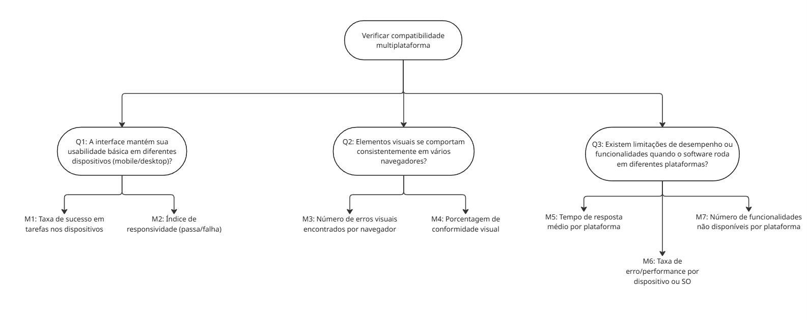
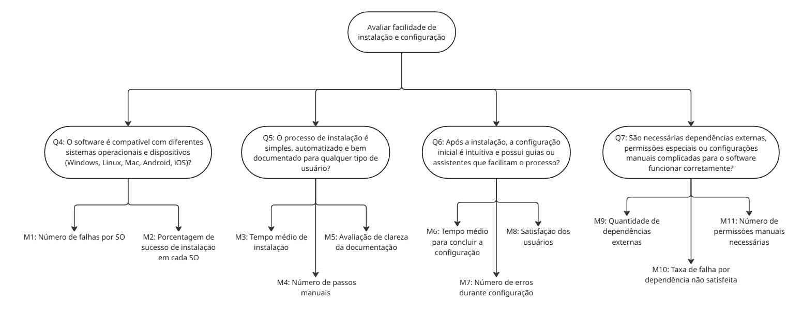

# Fase 2: Especificar a Avaliação

Nesta fase, a abordagem GQM (Goal-Question-Metric) é utilizada para traduzir os requisitos de qualidade definidos na Fase 1 em um plano de medição concreto e acionável. Este processo é essencial para frameworks como o **Q-Rapids**, que dependem de métricas bem definidas para alimentar seus painéis de decisão.

A avaliação focada em **Portabilidade** representa uma análise da perspectiva do **Produto**, um dos pilares do framework de medição **CID (Continuous Iterative Development)**.

## A Abordagem GQM (Goal-Question-Metric)

O GQM é um modelo hierárquico que estrutura o processo de medição de software para garantir que as métricas coletadas estejam diretamente alinhadas aos objetivos do projeto. Ele funciona em três níveis:

1.  **Goal (Objetivo):** Define o **propósito** da medição. Responde à pergunta: "*Por que estamos medindo isso?*".
2.  **Question (Pergunta):** Desdobra o objetivo em perguntas que precisam ser respondidas para determinar se o objetivo foi alcançado.
3.  **Metric (Métrica):** Define as medidas quantitativas que precisam ser coletadas para responder a cada pergunta de forma objetiva.

---

## Aplicação do GQM para Avaliar a Portabilidade

A seguir, a abordagem GQM é aplicada para detalhar a avaliação da característica de **Portabilidade** do AgroMart.

### Objetivo de Medição
| Componente        | Descrição                                 |
|-------------------|------------------------------------------|
| **Analisa** | Capacidade de adaptação do sistema      |
| **Propósito** | Avaliar a portabilidade da solução      |
| **Critérios** | Adaptabilidade e compatibilidade        |
| **Perspectiva** | Equipe técnica e usuários finais        |
| **Contexto** | Disciplina de Qualidade de Software     |

### Sub-Objetivo 1: Verificar compatibilidade multiplataforma

**Perguntas (Questions):**

| ID | Pergunta | Hipótese |
| --- | ------- | -------- |
| Q1 | A interface mantém sua usabilidade básica em diferentes dispositivos (mobile/desktop)? | Espera-se que pelo menos 90% dos usuários consigam realizar as tarefas principais em ambos os dispositivos. |
| Q2 | Os elementos visuais se comportam consistentemente em vários navegadores? | Espera-se que no mínimo 95% das páginas mantenham o mesmo layout e comportamento entre os navegadores mais utilizados. |
| Q3 | Existem limitações de desempenho ou funcionalidades quando o software roda em diferentes plataformas? | Espera-se que menos de 10% dos testes apresentem perda significativa de desempenho ou falhas de funcionalidade entre plataformas. |

**Métricas (Metrics) Derivadas:**

**Figura 1 -** Diagrama de Questões e Métricas para Compatibilidade.

**Abstraction Sheet - Objetivo 1**

| Elemento | Descrição |
| --- | --- |
| **Object** | **Software Agromart** — Verificar a compatibilidade multiplataforma do sistema em diferentes ambientes (dispositivos e navegadores). |
| **Purpose** | Avaliar se o software mantém seu funcionamento, aparência e usabilidade de forma consistente em diferentes dispositivos e navegadores. |
| **Quality Focus** | - **Portabilidade** - **Usabilidade multiplataforma** - **Consistência visual e funcional** |
| **Baseline Hypotheses** | - O sistema deve manter sua usabilidade e consistência visual em diferentes dispositivos e navegadores. - Não deve exigir configurações específicas para isso. |
| **Variation Factors** | - Tipo de dispositivo, Navegadores, Resoluções de tela, Sistemas operacionais. |
| **Impact of Variation Factors**| - A interface pode perder usabilidade se não se adaptar a telas menores. - Elementos visuais podem quebrar ou se desalinharem em navegadores diferentes. - Problemas de compatibilidade podem afetar a experiência do usuário. |

---

### Sub-Objetivo 2: Avaliar facilidade de instalação e configuração

**Perguntas (Questions):**

| ID | Pergunta | Hipótese |
| -- | -- | -- |
| Q4 | O software é compatível com diferentes sistemas operacionais e dispositivos? | Espera-se que o software funcione corretamente em pelo menos **95% das combinações** testadas. |
| Q5 | O processo de instalação é simples, automatizado e bem documentado? | Espera-se que pelo menos **90% dos usuários consigam instalar** sem ajuda técnica. |
| Q6 | A configuração inicial é intuitiva e possui guias ou assistentes? | Espera-se que **85% dos usuários** completem a configuração sem erros. |
| Q7 | São necessárias dependências ou configurações manuais complicadas? | Espera-se que **menos de 10% dos casos** exijam configurações complexas. |

**Métricas (Metrics) Derivadas:**

**Figura 2 -** Diagrama de Questões e Métricas para Instalação.

**Abstraction Sheet - Objetivo 2**

| Elemento | Descrição |
| --- | --- |
| **Object** | **Software Agromart** — Avaliação da compatibilidade, instalação e configuração. |
| **Purpose** | Avaliar se o software funciona corretamente em diferentes plataformas e se o processo de instalação e configuração é simples e acessível. |
| **Quality Focus** | - **Portabilidade** - **Facilidade de instalação e configuração** |
| **Baseline Hypotheses** | - O software deve funcionar em diferentes SOs e navegadores. - O processo de instalação deve ser simples e bem documentado. |
| **Variation Factors** | - Sistema operacional, Tipo de dispositivo, Navegadores, Perfil do usuário, Dependências externas. |
| **Impact of Variation Factors** | - Incompatibilidades podem comprometer a experiência. - Processos de instalação complexos podem gerar erros. - Problemas de renderização podem afetar a usabilidade. |