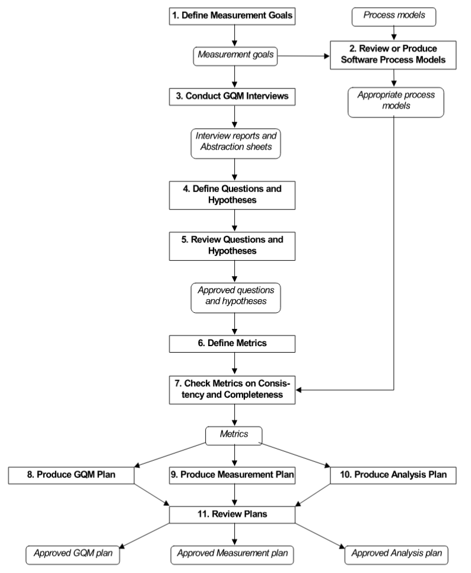

# Aplicação da Metodologia GQM 

A equipe adotou as oito primeiras etapas da metodologia GQM (Goal-Question-Metric) para orientar a avaliação da plataforma AgroMart.

O processo teve início com a definição dos objetivos de medição, com ênfase nos aspectos de usabilidade e confiabilidade. Em seguida, foi feita uma análise do contexto do sistema, acompanhada de discussões em grupo que auxiliaram na construção colaborativa dos abstraction sheets. Essa etapa foi essencial para alinhar as perguntas e hipóteses aos objetivos previamente estabelecidos.

As questões formuladas passaram por um processo de refinamento e foram associadas a métricas específicas, que também foram revisadas quanto à sua coerência e abrangência. Por fim, todos esses elementos foram organizados em um plano GQM, consolidando de forma estruturada a abordagem adotada.

**Figura 1 -** Definição de procedimentos GQM.

Fonte: Retirado de Basili et al., 2025

## Referências Bibliográficas

> 1. BASILI, Victor R.; CALDIERA, Gianluigi; ROMBACH, Hans Dieter. The Goal Question Metric (GQM) Approach. In: MARCINIAK, J. J. (ed.). Encyclopedia of Software Engineering. New York: John Wiley & Sons, 1994. cap. 6, p. 50. Ilust. (Figura 6-2).

# Histório de Versão

| Versão | Data | Descrição | Autor(a) |
|--------|------|----------|-------------------------------|
| 1.0    | 06/07/2025 |Criação do calendario e progresso | [João Lobo](https://github.com/joaolobo10)|