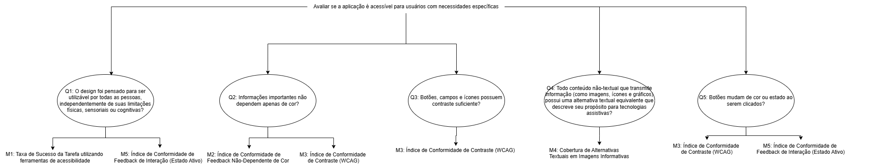

# Objetivo de Medição 1: Usabilidade

**Tabela 1-** Objetivo de Medição 1: Usabilidade.

| Analisar    | o AgroMart | 
| ---- | ------ |
| Para o propósito de | Avaliar se a aplicação é acessível para usuários com necessidades específicas      |
| Com respeito a | Usabilidade       |
| Do ponto de vista da | Equipe de desenvolvimento e usuários finais       |
| No contexto da | Disciplina de Qualidade de Software     |

## Questões Objetivo de Medição 1: Usabilidade

**Perguntas (Questions):**

> Q1: O design foi pensado para ser utilizável por todas as pessoas, independentemente de suas limitações físicas, sensoriais ou cognitivas?   **Hipótese 1:**Espera-se que a taxa de sucesso na conclusão de tarefas essenciais por usuários com deficiências (visuais, motoras, etc.) seja de, no mínimo, 85%.

> Q2: Informações importantes não dependem apenas de cor?   **Hipótese 2:** Espera-se que 100% dos elementos de feedback (como mensagens de erro/sucesso) utilizem, além da cor, um ícone ou texto explícito para comunicar seu status.

> Q3: Botões, campos e ícones possuem contraste suficiente?  **Hipótese 3:** Espera-se que 98% dos elementos de texto e componentes de interface (botões, campos) atendam à taxa de contraste mínima de 4.5:1 (WCAG AA).

> Q4: Todo conteúdo não-textual que transmite informação (como imagens, ícones e gráficos) possui uma alternativa textual equivalente que descreve seu propósito para tecnologias assistivas?   **Hipótese 4:** Espera-se que 100% das imagens que comunicam informações relevantes possuam um texto alternativo (alt) preenchido com uma descrição concisa e fiel ao conteúdo da imagem.

> Q5: Botões mudam de cor ou estado ao serem clicados?   **Hipótese 5:** Espera-se que 100% dos botões interativos do sistema apresentem uma mudança visual distinta (alteração de cor, sombra ou contorno) no estado :active, ou seja, enquanto estão sendo clicados.

## Relação entre Objetivos de Medição - Questões e Métricas - Objetivo de Medição 1: Usabilidade

**Figura 1 -** Diagrama de Questões e Métricas para Usabilidade.

## Seleção das Métricas

Com base na abordagem Goal-Question-Metric (GQM), selecionamos as seguintes métricas para a avaliação:

#### Usabilidade

- **M1: Taxa de Sucesso da Tarefa utilizando ferramentas de acessibilidade**
- **M2: Índice de Conformidade de Feedback Não-Dependente de Cor**
- **M3: Índice de Conformidade de Contraste (WCAG)**
- **M4: Cobertura de Alternativas Textuais em Imagens Informativas**
- **M5: Índice de Conformidade de Feedback de Interação (Estado Ativo)**

## Níveis de Pontuação das Métricas

Para cada métrica definida com a metodologia GQM, foram criados níveis de pontuação que ajudam a interpretar os resultados de forma clara e padronizada. Essa escala facilita a comparação entre métricas e orienta melhor as decisões sobre a qualidade da solução. Os valores foram definidos com base em boas práticas, referências da área e nas expectativas dos usuários.

A tabela abaixo mostra a escala adotada:

| **Desempenho da Métrica** | **Interpretação** | **Exemplo (Métrica de Contraste com meta de 98%)** |
| :--- | :--- | :--- |
| **Excelente (10)** | **Atinge ou supera a meta da hipótese.** Não há impacto negativo para o usuário. | Resultado: ≥ 98% de conformidade. |
| **Bom (7-9)** | **Próximo da meta.** Causa um impacto mínimo, mas a funcionalidade principal é mantida. | Resultado: Entre 90% e 97%. |
| **Regular (4-6)** | **Abaixo da meta.** Apresenta falhas perceptíveis que podem dificultar o uso para alguns. | Resultado: Entre 70% e 89%. |
| **Insatisfatório (1-3)**| **Falha Crítica.** Impede o acesso ou a conclusão de uma tarefa para um grupo de usuários. | Resultado: < 70%. |
## Critérios de Avaliação

Com os níveis de pontuação definidos, a equipe criou critérios simples para julgar o desempenho da plataforma em dois aspectos principais: usabilidade e confiabilidade. Esses critérios são baseados na média de desempenho das métricas avaliadas.

### Usabilidade

Avalia se o sistema é acessível e fácil de usar, entender e navegar.

| Nível de Conformidade | Condição para Atingir o Nível | Interpretação |
| :--- | :--- | :--- |
| **Conforme / Aceitável** | **Todas** as métricas de acessibilidade devem ter pontuação "Bom" ou "Excelente". | O sistema atende aos padrões de acessibilidade e usabilidade. Pode ter pequenas falhas, mas não há barreiras de acesso. |
| **Parcialmente Conforme / Aceitável com ressalvas** | **Nenhuma** métrica crítica com pontuação "Insatisfatório", mas uma ou mais métricas com pontuação "Regular". | O sistema é funcional para a maioria, mas apresenta barreiras de dificuldade média que precisam ser corrigidas com prioridade. |
| **Não Conforme / Inaceitável** | **Pelo menos uma** métrica com pontuação "Insatisfatório". | O sistema possui **pelo menos uma falha crítica** que impede o acesso ou o uso por um grupo de usuários. **Inaceitável para lançamento.** |