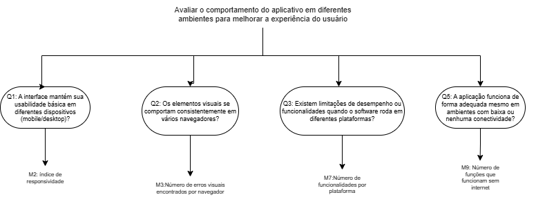

# Objetivo de Medição 2: Portabilidade

**Tabela 1-** Objetivo de Medição 1: Usabilidade.

| Analisar	| o AgroMart | 
| ---- | ------ |
| **Para o propósito de** | Avaliar o comportamento do aplicativo em diferentes ambientes para melhorar a experiência do usuário      |
| **Com respeito a** | Portabilidade       |
| **Do ponto de vista da** | Equipe de desenvolvimento        |
| **No contexto da** | Disciplina de Qualidade de Software     |

## Questões Objetivo de Medição 2: Portabilidade

**Perguntas (Questions):**

> **Q1:** A interface mantém sua usabilidade básica em diferentes dispositivos (mobile/desktop)?  **Hipótese 1:** Espera-se que pelo menos 90% dos usuários consigam realizar as tarefas principais em ambos os dispositivos.

> **Q2:** Os elementos visuais se comportam consistentemente em vários navegadores? **Hipótese 2:** Espera-se que no mínimo 95% das páginas mantenham o mesmo layout e comportamento entre os navegadores mais utilizados.

> **Q3:** Existem limitações de desempenho ou funcionalidades quando o software roda em diferentes plataformas?   **Hipótese 3:** Espera-se que menos de 10% dos testes apresentem perda significativa de desempenho ou falhas de funcionalidade entre plataformas.

> **Q4:** A aplicação funciona de forma adequada mesmo em ambientes com baixa ou nenhuma conectividade?   **Hipótese 4:** Espera-se que as funcionalidades essenciais estejam disponíveis mesmo em modo offline ou com conexão instável.

## Relação entre Objetivos de Medição - Questões e Métricas - Objetivo de Medição 2: Portabilidade

**Figura 1 -** Diagrama de Questões e Métricas para Portabilidade.

[João Lobo](https://github.com/joaolobo10), 2025

Clique nesse [link](https://drive.google.com/drive/folders/1GAmEliqammlkFNnF2ME-MrxfUyPv9Ify?usp=sharing) para a melhor visualização

## Seleção das Métricas

Com base na abordagem Goal-Question-Metric (GQM), selecionamos as seguintes métricas para a avaliação:

#### Confiabilidade

- **M1:** índice de responsividade
- **M2:**Número de erros visuais encontrados por navegador
- **M3:**Número de funcionalidades por plataforma 
- **M4:**Número de funções que funcionam sem internet 

## Níveis de Pontuação das Métricas

Para cada métrica definida, foi adotada a seguinte escala de pontuação para facilitar a interpretação dos resultados e apoiar decisões sobre melhorias:

A tabela abaixo mostra a escala adotada:

| **Desempenho da Métrica** | **Faixa de Valores** | **Interpretação Qualitativa**                                     |
| ------------------------- | -------------------- | ----------------------------------------------------------------- |
| **Excelente**             | 10                   | Atende completamente aos padrões de qualidade esperados.          |
| **Bom**                   | 7 - 9                | Funciona bem, com poucos pontos que podem ser melhorados.         |
| **Regular**               | 4 - 6                | Tem falhas visíveis, mas ainda pode ser usado de forma aceitável. |
| **Insatisfatório**        | 1 - 3                | Prejudica bastante a experiência ou confiança do usuário.         |

## Critérios de Avaliação

Portabilidade refere-se à capacidade da aplicação de funcionar corretamente em diferentes contextos: dispositivos variados (como celulares e computadores), sistemas operacionais (Android, iOS, Windows etc.), navegadores distintos e até situações com conectividade limitada. Com base na média de desempenho das métricas relacionadas, foram definidos os seguintes critérios de julgamento:

### Portabilidade

Avalia se o sistema é fácil de usar, entender e navegar.

- Aceitável: 70% ou mais das métricas classificadas como "Bom" ou "Excelente".
- Parcialmente aceitável: Entre 50% e 69% das métricas com nível "Bom" ou superior.
- Inaceitável: Menos de 50% das métricas atingindo "Bom" ou "Excelente".